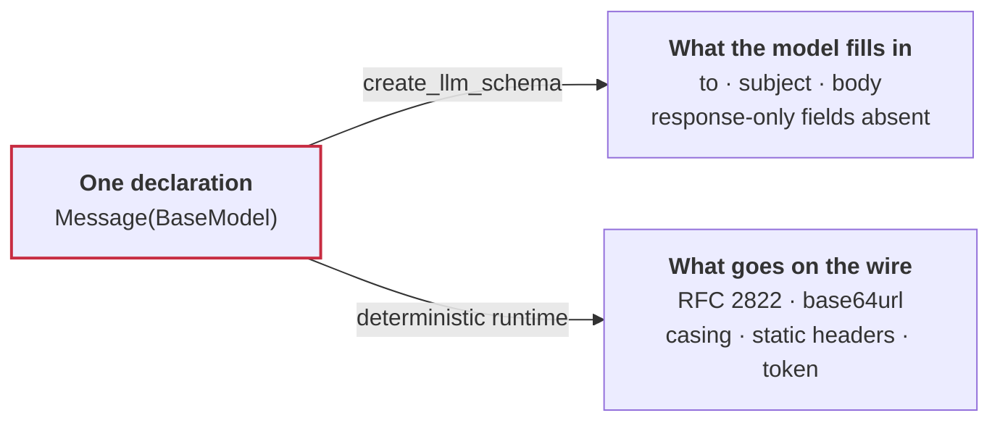

import AgentButton from '/snippets/agent-button.mdx';
import FrameworkHandoff from '/snippets/framework-handoff.mdx';

<AgentButton />

The schema is the contract. Charter turns a Pydantic schema into an agent tool. You declare what the model fills in and where each field belongs. The runtime handles the rest, including auth.

<div className="named-tabs" data-files="send_email.py|send_email.py">

<CodeGroup>

```python title="With Charter · 2 steps" highlight={8,15}
from typing import Annotated

from pydantic import BaseModel
from charter import Body, EmailContent, Format, oauth_tool_factory
from charter.auth import EnvTokenProvider


# 1. Describe the args the LLM fills in
class SendEmail(BaseModel):
    raw: Annotated[
        EmailContent, Body(envelop=True), Format("rfc822_base64")
    ]


# 2. Say where the request goes
gmail = oauth_tool_factory(
    pack="mygmail",
    base_url="https://gmail.googleapis.com/",
    provider="google",
    credential_provider=EnvTokenProvider("GOOGLE_ACCESS_TOKEN"),
)

send_email = gmail(
    name="send_email",
    description="Send an email.",
    method="POST",
    url_template="gmail/v1/users/me/messages/send",
    args_schema=SendEmail,
)

await send_email.ainvoke(
    raw={"to": "ada@example.com", "subject": "Hi", "body": "Hello"}
)
```

```python title="Without Charter · 6 steps" highlight={1,17,22,34,37,43}
# 1. Install google-auth, google-auth-oauthlib, google-api-python-client
import base64
import os.path
from email.message import EmailMessage

from google.auth.transport.requests import Request
from google.oauth2.credentials import Credentials
from google_auth_oauthlib.flow import InstalledAppFlow
from googleapiclient.discovery import build
from googleapiclient.errors import HttpError

SCOPES = ["https://www.googleapis.com/auth/gmail.send"]


def send_email(to: str, subject: str, body: str) -> str:
    """Send an email."""
    # 2. Run Google's OAuth flow
    creds = None
    if os.path.exists("token.json"):
        creds = Credentials.from_authorized_user_file("token.json", SCOPES)
    if not creds or not creds.valid:
        # 3. Refresh the token and persist it
        if creds and creds.expired and creds.refresh_token:
            creds.refresh(Request())
        else:
            flow = InstalledAppFlow.from_client_secrets_file(
                "credentials.json", SCOPES
            )
            creds = flow.run_local_server(port=0)
        with open("token.json", "w") as token:
            token.write(creds.to_json())

    try:
        # 4. Build the API client
        service = build("gmail", "v1", credentials=creds)

        # 5. Assemble the MIME document
        message = EmailMessage()
        message.set_content(body)
        message["To"] = to
        message["Subject"] = subject

        # 6. Encode, wrap in Gmail's envelope, send
        encoded = base64.urlsafe_b64encode(message.as_bytes()).decode()
        sent = (
            service.users()
            .messages()
            .send(userId="me", body={"raw": encoded})
            .execute()
        )
        return f'Message Id: {sent["id"]}'
    except HttpError as error:
        return f"An error occurred: {error}"


send_email(
    **{"to": "ada@example.com", "subject": "Hi", "body": "Hello"}
)
```

</CodeGroup>

</div>

Two steps against six, and one package to install against three. The model fills `to`, `subject` and `body` either way. With Charter, [`Format("rfc822_base64")`](/reference/markers#format) builds the [RFC 2822](https://datatracker.ietf.org/doc/html/rfc2822) document and encodes it base64url, [`Body(envelop=True)`](/reference/markers#body) puts it under the `raw` key Gmail expects, and the factory attaches the token. None of that is written, because [the schema already says what the request is](/tools/wire-contract).

```bash
pip install charter-ai
```

## The schema is all you need



The same declaration answers both questions, so they cannot disagree. A field
the model must not see is absent from the type it is handed, not filtered out of
a prompt afterwards.

Zero boilerplate. Zero plumbing. Zero extra libraries in the middle. Zero learning curve.

Writing an API tool becomes trivial, and every call is deterministic. Charter handles the rest.

Across 534 runs against live APIs, that surface handed the model roughly four times less response context than a raw HTTP tool, and produced none of the malformed GraphQL documents, undeclared endpoints or rejected base64 the raw arm did. Task success itself was a wash. [The full record, including the template that goes the other way.](/guarantees/measured-results)

[Read Why Charter for the full story.](/why-charter)

## Plugs into what you run

The framework you already use decides when to call a tool, and [Charter makes the call](/using/adapters).

<FrameworkHandoff />

Gmail is one of fifteen APIs that ship [already declared](/packs/overview). For an API no pack covers, [your coding agent can write the declaration](/start/coding-agents#the-pack-writing-skill).

## What you get

<Columns cols={2}>
  <Card title="Open and direct" icon="unlock" href="/why-charter#compared-with-the-alternatives">
    Apache 2.0. Your process calls the API. No proxy, no per-call price, no rate limit but the API's own.
  </Card>
  <Card title="Egress control" icon="shield" href="/boundary/egress-control">
    A field the model must not see is absent from its schema, and the map is printable.
  </Card>
  <Card title="Deterministic wire" icon="ethernet" href="/tools/transforms">
    MIME, base64url, protobuf and casing are declared once and built by the runtime, never by the model.
  </Card>
  <Card title="Runs where you run it" icon="server" href="/why-charter#the-covenant">
    No telemetry, no phone-home, no training on your traffic. The only network calls are the API calls you define.
  </Card>
</Columns>

## Next

<Columns cols={2}>
  <Card title="Quickstart" icon="rocket" href="/start/quickstart">
    Declare a tool, print the boundary, call a pack, hand it to a framework.
  </Card>
  <Card title="Packs" icon="boxes" href="/packs/overview">
    Fifteen integrations, 549 tools, ready to configure and call.
  </Card>
  <Card title="Coding agents" icon="sparkles" href="/start/coding-agents">
    The skill that teaches your agent to write packs, and these docs as a source.
  </Card>
  <Card title="MCP server" icon="plug" href="/using/mcp">
    Compile a pack into a lean server that speaks the protocol.
  </Card>
</Columns>
