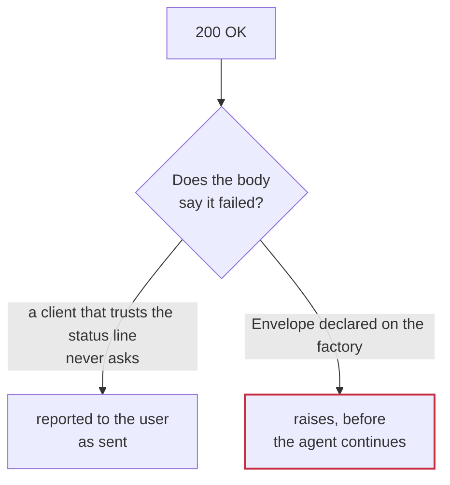

## When HTTP 200 does not mean success

A runtime that trusts the status line is wrong about a large family of APIs:

| API | Failure looks like |
|---|---|
| Slack | `200 OK` + `{"ok": false, "error": "channel_not_found"}` |
| Any GraphQL API | `200 OK` + `{"data": null, "errors": [...]}` |
| Shopify, older Facebook Graph | `200 OK` + an errors collection |
| A long tail of JSON APIs | `200 OK` + `{"status": "error", "message": "..."}` |



Left alone, the model receives an error payload as if it were a success and
reports the message sent. The mistake is silent and downstream.

Writing a per-tool check is not the fix. A check you have to remember to add is
one that eventually gets forgotten — and it puts the same code in every pack. The
success predicate is part of the API's contract, so it is declared like the rest
of the contract: once, and the runtime enforces it.

## Declaring one

An [`Envelope`](/reference/envelopes-and-pagination#envelope) goes on the
factory, beside the rest of the API's contract:

```python slack_envelope.py
from charter import Envelope, oauth_tool_factory

SLACK_ENVELOPE = Envelope(
    ok_field="ok",                      # falsy => failure
    error_field="error",                # where the code lives
    credential_errors={"invalid_auth", "token_revoked", "missing_scope"},
    detail_fields=("needed",),          # names the missing scope
)

slack = oauth_tool_factory(
    pack="myslack",
    base_url="https://slack.com/api/",
    provider="slack",
    credential_provider=provider,
    envelope=SLACK_ENVELOPE,
)
```

Every tool that factory builds now raises on a failed body, exactly as it would
on a 4xx. There is no per-tool step.

Two shapes cover almost everything:

**A success flag** — `ok_field` must be truthy. For APIs that report a word
rather than a bool, add `ok_value`:

```python
Envelope(ok_field="status", ok_value="ok", error_field="message")
```

**An error collection** — `errors_field` holding a non-empty list means failure.
This is the GraphQL convention, and it ships ready-made:

```python
from charter import GRAPHQL_ENVELOPE   # Envelope(errors_field="errors")
```

[`GRAPHQL_ENVELOPE`](/reference/envelopes-and-pagination#graphql_envelope) is
that declaration, exported ready to use.

## What it raises

`credential_errors` decides which of the two typed errors comes out, so a host
application can tell "refresh the token and retry" from "the request was wrong":

- code in `credential_errors` → [`CredentialError`](/reference/errors#credentialerror), tagged with the provider
- anything else → [`APIError`](/reference/errors#apierror)

`APIError.status_code` is `200` on purpose. That really was the status, and it is
the fact that surprises whoever reads the log later.

## Where it runs

```
HTTP status >= 400   ->  CredentialError / APIError
envelope says failed ->  CredentialError / APIError
response_handler                          <- only ever sees a success
```

Response handlers are for context economy. Trimming a failed payload is
meaningless, so the envelope raises first — which also means a handler never
needs a defensive check at the top.

## Per-endpoint override

Rare, but some APIs are inconsistent across endpoints:

```python per_endpoint_envelope.py
odd_one = factory(
    name="odd_endpoint",
    args_schema=OddRequest,
    method="GET",
    url_template="v1/odd",
    envelope_override=GRAPHQL_ENVELOPE,
)
```

## Scope

An envelope decides *whether* a response is a failure and *what to raise*. It does
not retry, does not inspect HTTP status (that is handled before it), and does not
reshape a successful payload — that is a response handler's job.

## Related

- [Tool validation and error handling](/running/tool-validation-error-handling)
- [Writing a pack](https://github.com/r28ai/charter/blob/main/skills/writing-charter-packs/SKILL.md)
- [`Envelope`](/reference/envelopes-and-pagination#envelope) — every field, the path syntax, the methods
- [`ResponseHandler`](/reference/response-handling#responsehandler) — what shapes a payload once it has passed

## When failure is not at the root

Everything above assumes the failure flag sits at the top of the response. For a
GraphQL mutation it does not.

`errors` is for problems with the *document* — a syntax error, an unknown field,
a type mismatch. A mutation the server understood and then **declined** produces
none of that. It returns HTTP 200, no `errors`, and the refusal inside the
payload, one level below the operation name:

```json
{"data": {"issueCreate":   {"success": false, "issue": null}}}
{"data": {"productCreate": {"product": null, "userErrors": [{"field": ["handle"], "message": "Handle has already been taken"}]}}}
```

Every signal a runtime normally trusts says the write happened.

So the field names on an `Envelope` are
[**paths**](/reference/envelopes-and-pagination#paths), and a path may contain
`*` to stand for whichever operation the tool called:

```python linear_envelope.py
LINEAR = Envelope(
    errors_field="errors",
    ok_field="data.*.success",
)

SHOPIFY = Envelope(
    errors_field=("errors", "data.*.userErrors"),
)
```

`errors_field` takes one path or several, so both places an API reports failure
are covered by one declaration. A wildcard matches exactly one level — it is not
a recursive search — and matching nothing is not a failure, so a query with no
`success` and no `userErrors` passes through untouched.

The message names the resolved path, which is the useful half: `data.issueCreate.
success is false` says *which write* was declined, without the envelope knowing
anything about Linear.

### Why this is a declaration and not a response handler

The same check written into each mutation's `response_handler` passes the same
tests. It is still wrong, for one reason: it is opt-in per tool. Add a mutation
in a hurry, forget the handler, and that tool reports a failed write as a
success — silently, in production, on the operation that changes data.

This is the third time this project has met that shape. Slack's `ok:false` was
per-tool before it became an `Envelope`; API-key guarding was per-tool
`build_request=_guard(...)` before it moved into the runtime. Both are now
declarations, and both have a test named for the tool nobody remembered to
update. So does this:

```
test_a_mutation_added_without_ceremony_is_still_guarded
```

If a rule is true of the API rather than of one endpoint, it belongs on the
factory. A response handler is for *shaping* what came back, not for deciding
whether it succeeded.
